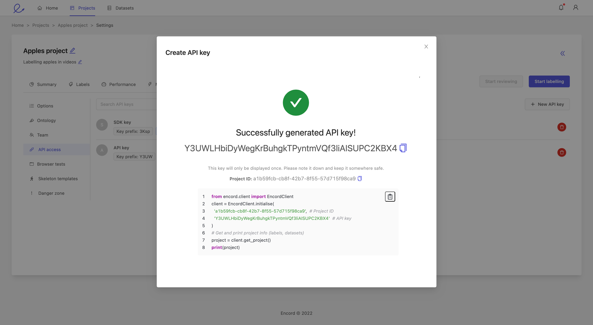

.. include:: ./substitutes.rst

**************
Authentication
**************

Set up authentication keys
==========================
You can authenticate with |company| on a user basis by registering a public key, or on a specific project or dataset basis by using an |company|-generated API key tied to that resource.

* :ref:`authentication:Register a public key`: registering a public key gives you full access, allowing you to access all your projects and datasets, as well as create new projects, datasets and API keys
* :ref:`authentication:Create an API key`: creating an API key gives you restricted access to a particular project or dataset

Public keys are used to authenticate the user for activities that require user-level access, for example creating projects and datasets.
API keys are more restrictive and are tied to a particular project or dataset.
API keys are used to authenticate calls that only require resource-level access, for example downloading label rows from a particular project.

Register a public key
---------------------
Public keys are tied to the user so need to be added to your profile.
To register a public key, please follow the instructions in :xref:`public_keys` of the |sdk| documentation.

Create an API key
-----------------

API keys are tied to specific projects or datasets.
You can generate multiple keys for each project or dataset.
To create an API key:

#. Log in to your account on :xref:`login_url`
#. Navigate to the :xref:`project` or :xref:`dataset` tab in the :xref:`navigation_bar`
#. Select a project or dataset
#. Navigate to the 'Settings' tab and select the 'API access' pane on the left
#. Click on the *+ New API key* button, select relevant scopes and click the *Create* button
#. Copy your API key and make a note of the project or dataset ID. The API key is only displayed once. Example code is also displayed

Authenticate with Encord
========================

Once you have registered a public key or created an API key, you can authenticate your SDK client with |company| and get started with the SDK.

Public key authentication
-------------------------

If you are using public key authentication, authenticate with |company| by passing the corresponding private key to an :class:`.EncordUserClient`.
Once you have an :class:`.EncordUserClient`, you can use it to create new projects and datasets, or interact with existing ones by creating separate :class:`.EncordClient` objects tied to them

.. literalinclude:: code_examples/authenticate_ssh.py
    :language: python

API key authentication
----------------------

If you are using API key authentication, authenticate with |company| by passing the resource ID (project or dataset ID) and associated API key to an :class:`.EncordClient`.
This will directly create an :class:`.EncordClient` to interact with a specific project or dataset

.. literalinclude:: code_examples/authenticate_api_key.py
    :language: python

You can instantiate several :class:`.EncordClient` objects by creating an :class:`.EncordConfig` object first.
Pass the resource ID and API key as strings, and initialise the clients with the config object

.. literalinclude:: code_examples/authenticate_config.py
    :language: python

